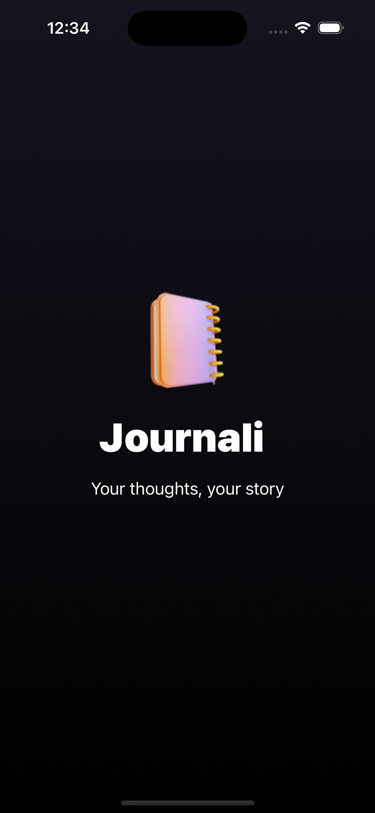
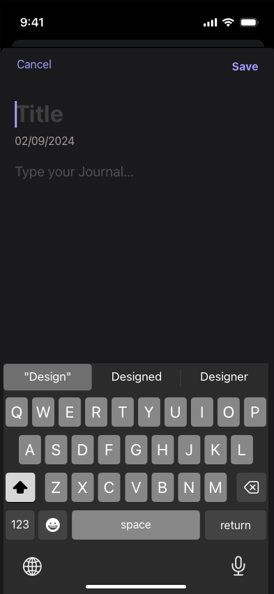
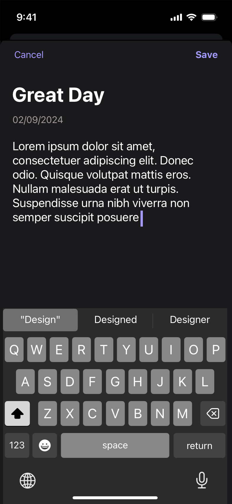
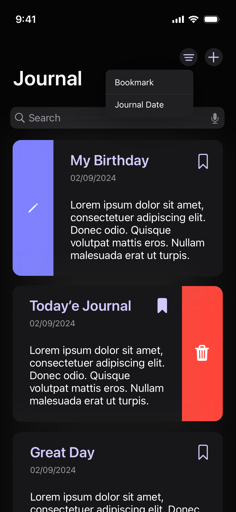
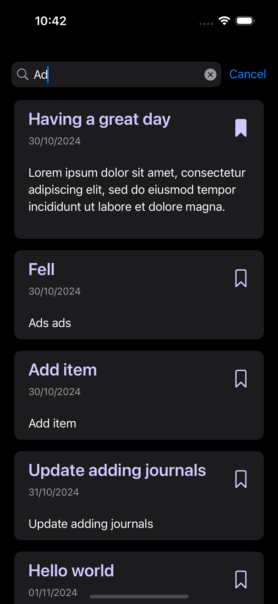
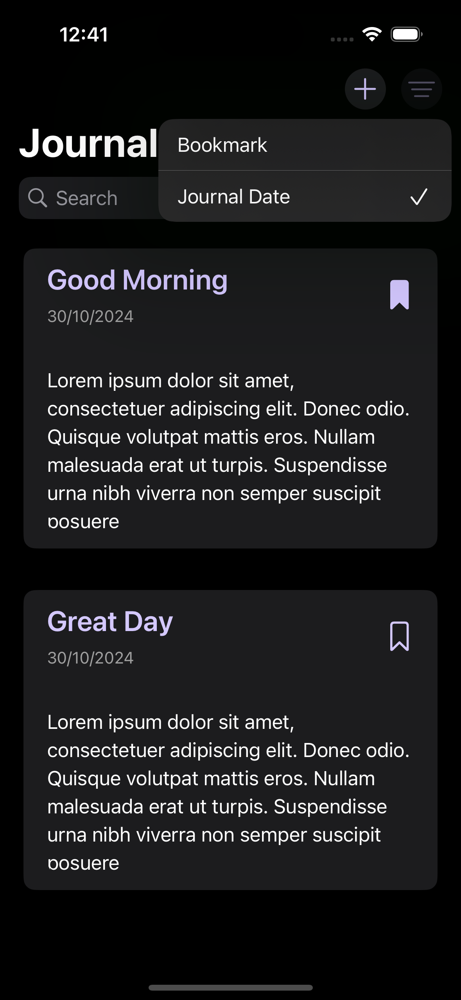

# Journali 📒
Your thoughts, your story
<!---->


## Usage  🔭
Your personal digital diary. Easily write, organize, and reflect on your thoughts, experiences, and feelings in a private and secure space.

## Tools ⚒️
- SwiftUI 
- SwiftData
- Sketch app 
- Xcode

## Featuers ✨
### Meet journali app:
1. **Creating** a new journal entry, to write your thoughts and experiences. 
2. **Editing** an existing journal entry, to update or correct your thoughts. 
3. **Deleting** a journal entry, to remove entries that you no longer want to keep. 
4. **Searching** for specific words or phrases, to quickly find relevant thoughts or memories. 
5. **Bookmarking** specific journal entries, to easily find your favorite or important entries later. 
6. **Filtering** journal entries, to view those that are bookmarked to access your most important notes.


<!--  -->

<!-- 1.  Creating a new journal entry, to write your thoughts and experiences. -->
<!--  2.  Editing an existing journal entry, to update or correct your thoughts.
3.  Deleting a journal entry, to remove entries that you no longer want to keep.
4.  Searching for specific words or phrases, to quickly find relevant thoughts or memories.
5.  Bookmarking specific journal entries, to easily find your favorite or important entries later.
6.  Filtering journal entries, to view those that are bookmarked to access your most important notes. -->


# Discover the technologies 🔦  
## MVVM 🧨
If you are a developer, you might have heard of MVVM, which stands for Model View ViewModel. A good way to practice clean code is to look around and learn to form others' code. This project implements the power of MVVM to structure the code to make it clean to understand and to debug errors. It makes the code easily readable.

## Why to use Swiftdata 📊
SwiftData is a powerful and expressive persistence framework built for Swift. It is an easy-to-use way to store data in apps built for iOS, macOS, tvOS, watchOS, and even visionOS. It can be easily used to implememt **Searching**, **filtering**, **fetching** data, and much more.


### See SwiftData in this project
<!-- - Featche the whole list of journals and show them in the main contentView. -->
```Swift 
@Query private var journals: [JournalModel]
```

```Swift 
@Environment(\.modelContext) var modelContext
```

### These tow couple of lines of code are like a magic to adjusting MVVM
```Swift 
@StateObject private var viewModel = JournalViewModel()
```

```Swift 
@Published var isEditing: Bool
```
